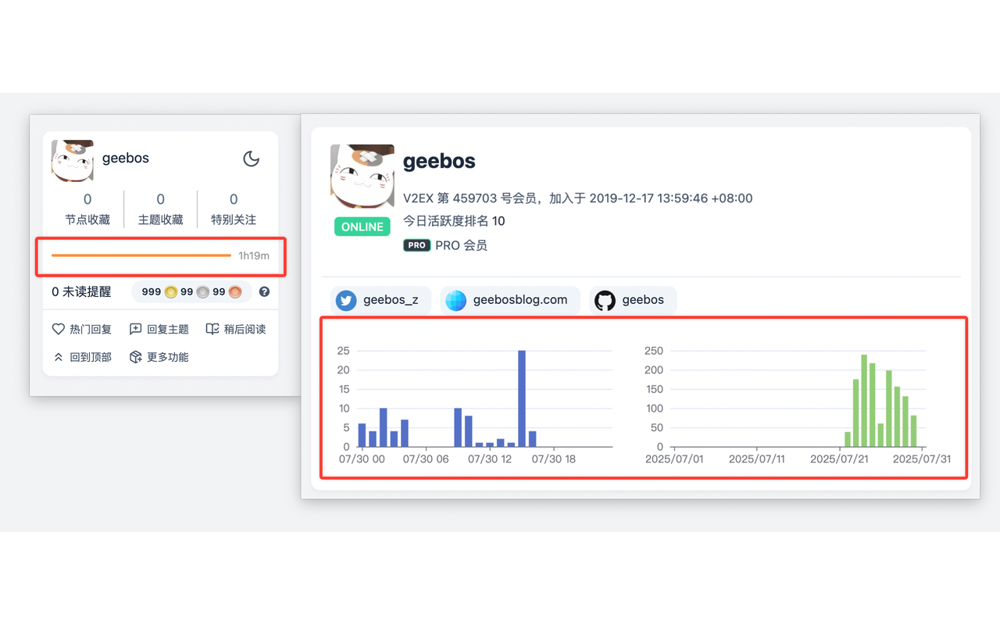
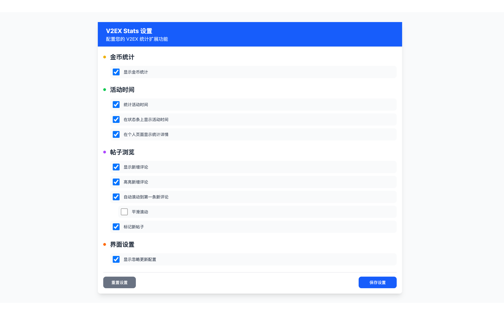

# V2EX Stats

[](https://github.com/geebos/v2ex-coins-chart/releases)

[](https://chromewebstore.google.com/detail/v2ex-stats/kclaclglgljalkhaihmicdlcnaacpghp) [](https://addons.mozilla.org/zh-CN/firefox/addon/v2ex-stats/)

V2EX 硬币获取记录可视化扩展插件 —— 让您的 V2EX 硬币收益一目了然

## ✨ 功能特性

- **📈 硬币记录可视化**：自动抓取并本地缓存 `/balance` 的硬币记录，以折线图/饼图展示趋势与分布
- **🗓️ 多时间粒度与时间范围**：支持分钟/小时/天/月粒度，支持全部/最近一年/半年/最近一月/自定义范围查看
- **⏱️ 在线时长统计**：在 V2EX 页面内统计活跃在线时长，支持按区间汇总、分布分析与同比对比
- **📱 年终总结**：聚合近一年的行为数据（发帖/回复/登录/感谢等）生成年度报告，包含活动时间热力图与称号，并支持单页导出图片
- **💾 存储占用提示**：在界面中快速查看当前扩展本地存储占用（tooltip 形式展示）
- **🗜️ 存储空间优化**：对历史数据进行压缩存储与自动迁移，在不影响功能的前提下降低占用
- **🔒 数据本地存储**：所有数据仅存储在浏览器本地，确保您的隐私安全
- **👀 代码完全透明**：开源代码，可随时查看和审查，确保安全可信
- **🚀 轻量高效**：基于现代 Web 技术构建，运行流畅，占用资源少

## 🛡️ 隐私与安全

- **本地存储**：所有数据仅存储在您的浏览器本地，不会上传到任何服务器
- **开源透明**：代码完全开源，您可以随时查看和审查每一行代码
- **无网络请求**：除了访问 V2EX 页面本身，不会向任何第三方服务发送数据
- **权限最小化**：仅请求必要的浏览器权限，保护您的隐私

## 📊 功能预览

### 数据概览


### 硬币收支趋势（折线图）


### 硬币类型分布（饼图）


### 在线时长统计


### 帖子 / 评论信息标记


### 设置页


## 🚀 本地运行

### 环境要求

- Node.js >= 16
- pnpm

### 初始化项目

```bash
# 安装依赖
pnpm install
```

### 开发调试

```bash
# 启动开发模式
pnpm dev

# 针对 Firefox 开发
pnpm dev:firefox
```

开发模式下，扩展会自动重新加载，方便调试。

### 打包发布

```bash
# 打包 Chrome 版本
pnpm zip

# 打包 Firefox 版本
pnpm zip:firefox
```

打包完成后，生成的文件位于 `.output/` 目录下。

### 安装使用

#### Chrome/Edge

1. 运行 `pnpm zip` 生成扩展包
2. 打开 Chrome 扩展页面 (`chrome://extensions/`)
3. 开启"开发者模式"
4. 点击"加载已解压的扩展程序"
5. 选择 `.output/chrome-mv3` 目录

#### Firefox

1. 运行 `pnpm zip:firefox` 生成扩展包
2. 打开 Firefox 附加组件页面 (`about:addons`)
3. 点击设置图标，选择"从文件安装附加组件"
4. 选择 `.output/` 目录下的 `.zip` 文件

## 📝 使用说明

1. 安装并启用扩展后，访问 https://v2ex.com/balance
2. 扩展将自动检测并记录您的硬币变动记录，并展示可视化图表
3. 在 V2EX 页面内即可查看统计信息；年终总结入口会在首页个人信息区域附近出现（如已启用）

## 🧪 测试

```bash
# 运行测试
pnpm test

# 监听模式运行测试
pnpm test:watch

# 生成覆盖率报告
pnpm test:coverage

# 测试 UI 界面
pnpm test:ui
```

## 📄 使用协议

本项目仅供代码审查和学习参考使用。

### 使用限制

- ✅ **允许**：查看和审查源代码
- ✅ **允许**：用于非公开的学习和研究目的
- ❌ **禁止**：复制、修改、分发代码
- ❌ **禁止**：用于商业用途
- ❌ **禁止**：重新发布或二次开发

### 版权声明

本项目及其所有代码版权归作者所有，保留所有权利。
