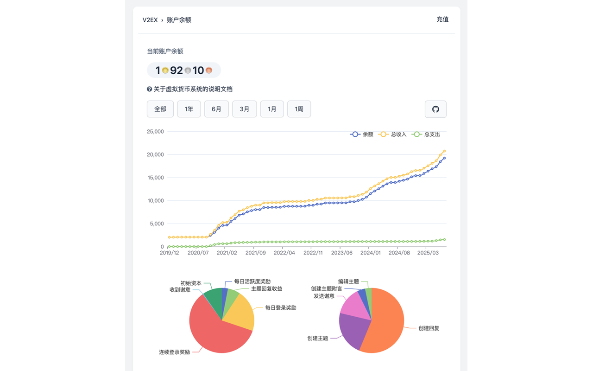
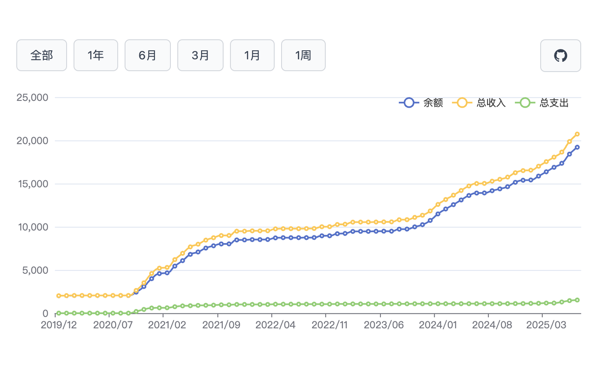
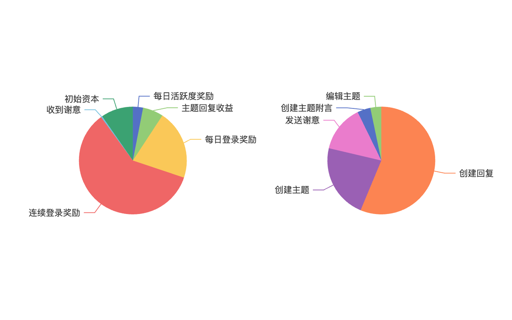

# V2EX Stats

V2EX 硬币获取记录可视化扩展插件 —— 让您的 V2EX 硬币收益一目了然

## 📊 功能预览

### 数据概览


### 收益折线图


### 收益分布饼图


## ✨ 功能特性

- **📈 数据可视化**：以直观的图表形式展示您的 V2EX 硬币收益趋势
- **📊 多维度统计**：提供折线图、饼图等多种图表类型，全方位分析您的收益情况
- **🔒 数据本地存储**：所有数据均存储在浏览器本地，确保您的隐私安全
- **👀 代码完全透明**：开源代码，可随时查看和审查，确保安全可信
- **🚀 轻量高效**：基于现代 Web 技术构建，运行流畅，占用资源少
- **⚡ 实时更新**：自动检测 V2EX 硬币页面，实时记录和更新数据

## 🛡️ 隐私与安全

- **本地存储**：所有数据仅存储在您的浏览器本地，不会上传到任何服务器
- **开源透明**：代码完全开源，您可以随时查看和审查每一行代码
- **无网络请求**：除了访问 V2EX 页面本身，不会向任何第三方服务发送数据
- **权限最小化**：仅请求必要的浏览器权限，保护您的隐私

## 🚀 本地运行

### 环境要求

- Node.js >= 16
- pnpm

### 初始化项目

```bash
# 安装依赖
pnpm install
```

### 开发调试

```bash
# 启动开发模式
pnpm dev

# 针对 Firefox 开发
pnpm dev:firefox
```

开发模式下，扩展会自动重新加载，方便调试。

### 打包发布

```bash
# 打包 Chrome 版本
pnpm zip

# 打包 Firefox 版本
pnpm zip:firefox
```

打包完成后，生成的文件位于 `.output/` 目录下。

## 🔧 安装使用

### Chrome/Edge

1. 运行 `pnpm zip` 生成扩展包
2. 打开 Chrome 扩展页面 (`chrome://extensions/`)
3. 开启"开发者模式"
4. 点击"加载已解压的扩展程序"
5. 选择 `.output/chrome-mv3` 目录

### Firefox

1. 运行 `pnpm zip:firefox` 生成扩展包
2. 打开 Firefox 附加组件页面 (`about:addons`)
3. 点击设置图标，选择"从文件安装附加组件"
4. 选择 `.output/` 目录下的 `.zip` 文件

## 📝 使用说明

1. 安装并启用扩展后，访问 https://v2ex.com/balance
2. 扩展将自动检测并记录您的硬币获取记录
3. 点击扩展图标或查看页面内嵌的图表，即可查看详细的数据分析

## 🧪 测试

```bash
# 运行测试
pnpm test

# 监听模式运行测试
pnpm test:watch

# 生成覆盖率报告
pnpm test:coverage

# 测试 UI 界面
pnpm test:ui
```

## 📄 使用协议

本项目仅供代码审查和学习参考使用。

### 使用限制

- ✅ **允许**：查看和审查源代码
- ✅ **允许**：用于非公开的学习和研究目的
- ❌ **禁止**：复制、修改、分发代码
- ❌ **禁止**：用于商业用途
- ❌ **禁止**：重新发布或二次开发

### 版权声明

本项目及其所有代码版权归作者所有，保留所有权利。
